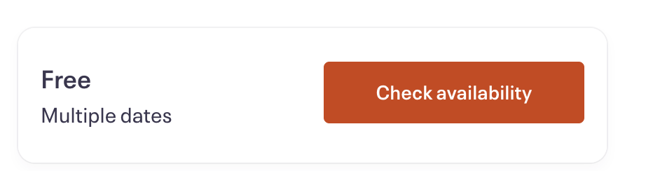
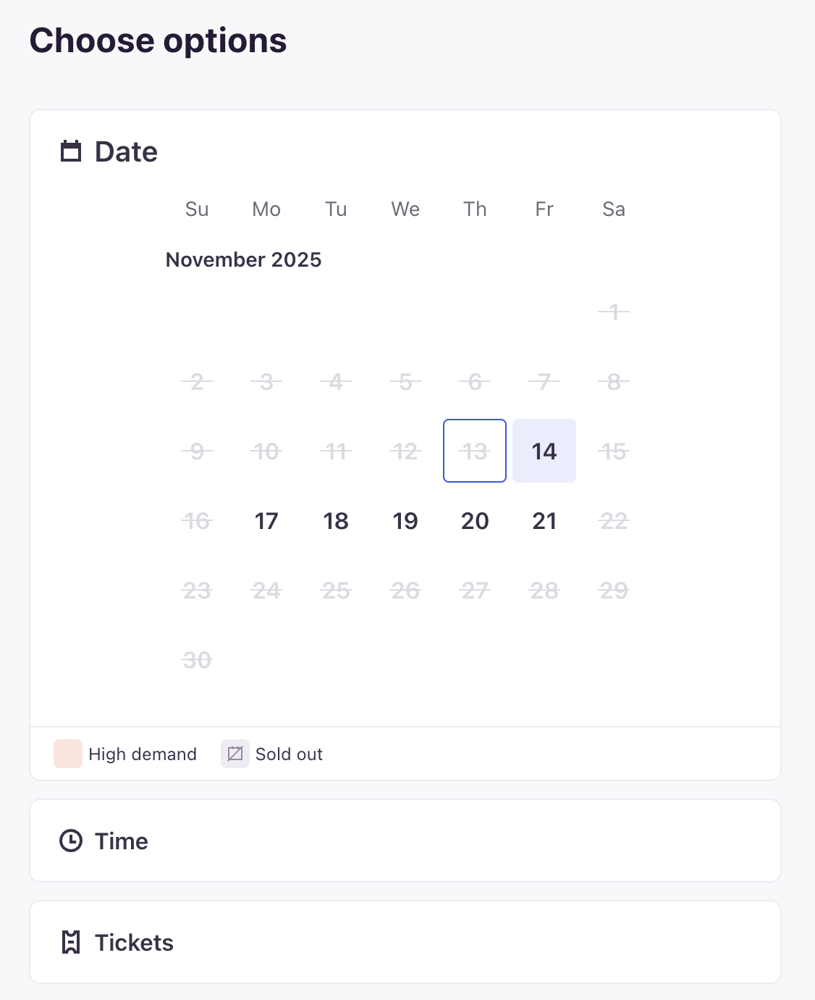
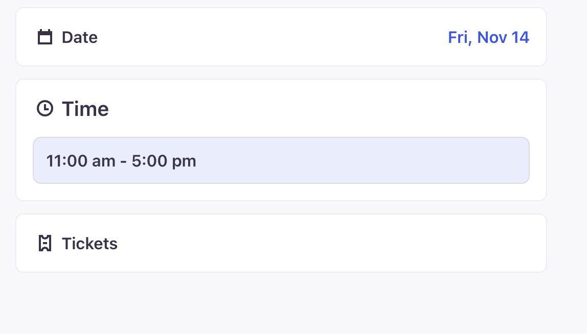
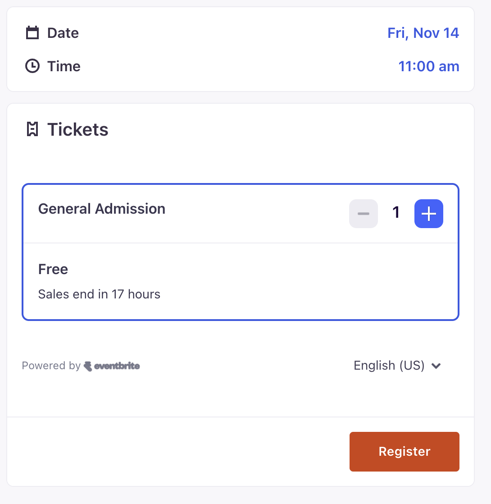

# Eventbrite チケット自動予約システム
claudeAIで作成しました。
Eventbriteのチケットの空き状況を自動的に監視し、空き枠が見つかった際に自動的に予約を試みるシステムです。
(seleniumによる操作は一部のフォーマットのみ対応です。) 
例：check Availability→カレンダー選択→枚数選択→Register

## 機能

- 🔍 **自動監視**: Eventbrite APIを使用してチケットの空き状況を定期的にチェック
- 🤖 **自動予約**: 空き枠が見つかった場合、Seleniumを使用して自動的に予約処理を実行
- 💾 **セッション保存**: ログイン情報をブラウザセッションとして保存し、再利用
- 📱 **Discord通知**: 空き枠が見つかった際にDiscordに通知（オプション）
- ⚡ **高速処理**: 並列リクエストによる高速なチケット確認

## 必要な環境

- Python 3.7以上
- Google Chrome ブラウザ
- ChromeDriver（Seleniumで使用）

## インストール

1. **リポジトリをクローン**:
   ```bash
   git clone <repository-url>
   cd eventbrite
   ```

2. **必要なパッケージをインストール**:
   ```bash
   pip install -r requirements.txt
   ```

3. **環境変数を設定**:
   `.env.example`をコピーして`.env`ファイルを作成し、以下の情報を設定します：
   ```bash
   cp .env.example .env
   ```

   `.env`ファイルを編集：
   ```env
   # EventbriteのAPIトークン（必須）
   # https://www.eventbrite.com/platform/api-keys から取得
   API_TOKEN=your_eventbrite_api_token_here

   # Discord Webhook URL（オプション）
   # Discordサーバーの設定 > 連携サービス > ウェブフック から取得
   DISCORD_WEBHOOK_URL=your_discord_webhook_url_here
   ```

## 設定

[app.py](app.py) の設定項目を編集してください：

```python
# イベントID（EventbriteのイベントURLから取得）
EVENT_ID = '1247015881069'

# チケット確認の間隔（秒）
# 注意：1.0秒以下にするとAPI制限に引っかかる可能性があります
POLL_INTERVAL = 1.8

# 並列取得を有効化するかどうか（1: 有効, 0: 無効）
ENABLE_PARALLEL_FETCH = 1

# 在庫発見時に即座に終了するかどうか（1: 即座に終了, 0: すべてのページを取得）
EARLY_EXIT = 0

# 並列リクエストの最大数
MAX_WORKERS = 10
```

## 使い方

1. **プログラムを実行**:
   ```bash
   python app.py
   ```

2. **ブラウザでログイン**:
   - Chromeブラウザが自動的に開きます
   - Eventbriteにログインしてください
   - ログイン完了後、ターミナルでEnterキーを押します

3. **監視開始**:
   - プログラムが自動的にチケットの空き状況を監視します
   - ブラウザは開いたままにしておいてください

4. **自動予約**:
   - 空き枠が見つかると自動的に予約処理を開始します
   - Discord通知が設定されている場合、通知が送信されます
   - 最後のチェックアウトは手動で完了してください

5. **停止**:
   - `Ctrl+C`で監視を停止できます

## Seleniumによる自動予約の流れ

プログラムが空き枠を検出すると、以下の手順で自動的に予約処理を行います（以下のフォーマットに対応しています）：

1. **Check Availabilityをクリック**

   

2. **カレンダーから空いている日付を自動選択**

   

3. **空いている時間を自動選択**

   

4. **チケットの枚数を選択（1枚で固定：複数枚欲しい場合、プログラムを同時に複数動かすこと。）**

5. **Registerを自動選択**

   

## 注意事項

⚠️ **重要な注意事項**:

- `POLL_INTERVAL`は1.8秒以上に設定してください（API制限回避のため）
- ブラウザは監視中も開いたままにしておいてください
- API制限（429エラー）が発生した場合、プログラムは自動的に停止します

## ファイル構成

```
eventbrite/
├── app.py                 # メインプログラム
├── requirements.txt       # 必要なPythonパッケージ
├── .env                   # 環境変数
├── .env.example          # 環境変数のテンプレート
├── .gitignore            # Git除外ファイル
└── README.md             # このファイル
```

## ライセンス

このプロジェクトは個人利用を目的としています。

## 免責事項

このツールは教育目的で作成されています。このツールの使用によって生じたいかなる問題についても、作者は責任を負いません。

---

## 📌 課題

- [ ] (SOLD_OUT→Unavailable→available→Unavailable→SOLD_OUT)このような挙動をしているから、  
      soldoutのときはゆっくりget(5~10秒間隔？)  
      soldoutからunavailableに変わったのを検知したら、0.5s間隔で早くgetするようにする。

      The default limit is:
      2,000 calls/hour
      48,000 calls/day
      https://www.eventbrite.com/platform/docs/rate-limits

- [ ] 初回起動時は動作が不安定なので一度落としてから使ってください。


